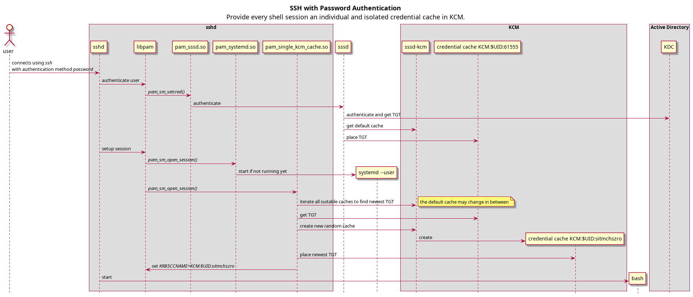
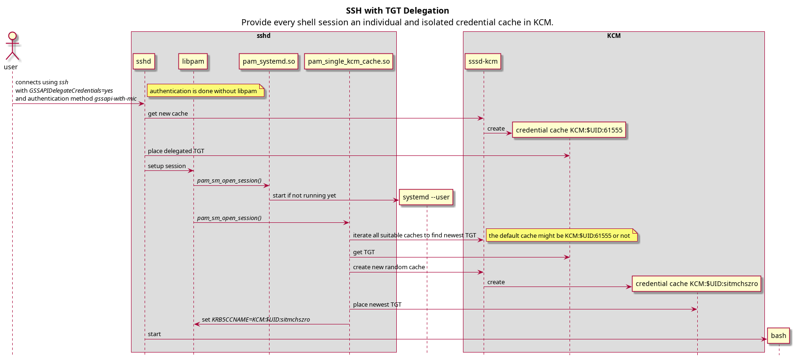
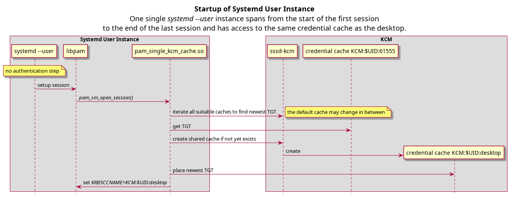
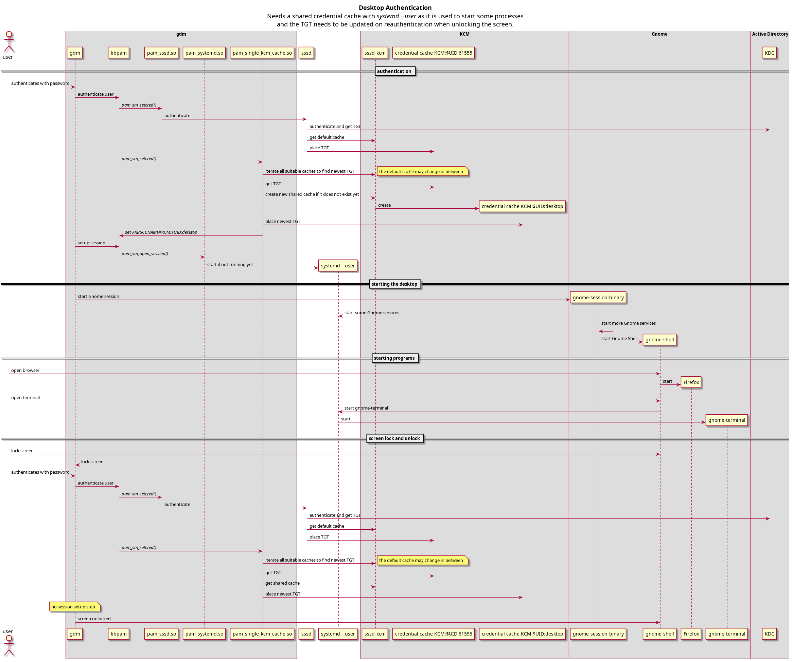

# PAM Single KCM Cache

This PAM module enforces the use of a single KCM Kerberos credential cache by creating and populating a custom or random cache and sets as default cache for the new user session by setting the `KRB5CCNAME` environment variable accordingly.

## Problems with `sssd-kcm`

The Kerberos setup should work for the end user out of the box for normal use cases without the need to understand Kerberos internals and the necessity to do manual interaction with the ticket cache to make it work. For advanced use cases (like temporarily using a differnt principal) this is OK.

With Red Hat Enterprise Linux 8 the default Kerberos credential cache is `KCM:` (Kerberos Cache Manager, [details about different cache types](https://web.mit.edu/kerberos/krb5-devel/doc/basic/ccache_def.html#ccache-types)) backed by `sssd-kcm` ([details](https://access.redhat.com/documentation/en-us/red_hat_enterprise_linux/8/html/considerations_in_adopting_rhel_8/identity-management_considerations-in-adopting-rhel-8#kcm-replace-keyring-default-cache_considerations-in-adopting-RHEL-8)).

While it might be better for container use cases and will automatically renew tickets, it showed to be problematic for more than the most simple end user usage. Im our environment we may have on one machine

- local deskop sessions
- remote desktop sessions
- remote ssh sessions
- long running computations
- AFS

which leads to a multitude of caches created automatically. But here the problems started because

>  If the cache name is just `KCM:`, the default cache as determined by the KCM daemon will be used.

as `sssd-kcm` is at times a bit unlucky in its selection of the default cache.
We got caches with expired tickets while other caches had valid tickets.
Or when the user on the shell authenticated for a different principal with administrative rights, all other sessions would now also use the different principal.

And there is also a Gnome component which cannot handle multiple credential caches gracefully ([goa-indentity-service bug](https://gitlab.gnome.org/GNOME/gnome-online-accounts/-/issues/79)).

## Solution
The solution is to have one fixed credential cache, backed by `KCM`, per user session. This can be achived by setting the `KRB5CCNAME` environment variable to the according individual cache in the session setup in PAM. The new or delegated TGT (ticket granting ticket) is then copied over from wherever it has been placed in the `KCM` to the expected credential cache.

The suggestion is to use a common and shared desktop cache for all desktop sessions (which are rarely more than one).

But in contrast shell sessions (mainly `ssh`, but also logins on the virtual console or with `su`) should have an individual credential cache which isolates these sessions from the other sessions and the desktop.

A special case is the `systemd --user` instance which starts with the first session and ends with the last session. Here it makes sense to use the same cache as the desktop sessions.

### Configuration for Shell Sessions

In the PAM configuration in `/etc/pam.d` add to the configuration of session setup tool (e.g. `sshd`, `login`, `su`):

```
session    optional     pam_single_kcm_cache.so random
```

### Configuration for Desktop Sessions
In the PAM configuration in `/etc/pam.d` add to the configuration of the Display Manager (e.g. `gdm-password`, `sddm`, `lightdm`):

```
auth       optional     pam_single_kcm_cache.so suffix=desktop
```
Note that this was only tested with `gdm` and there it needs to be at the end of the `auth` section. Like this it work also for the screen unlock which does not create a new session.


### Configuration for `systemd --user`
Extend the PAM configuration in `/etc/pam.d/systemd-user` with:

```
session    optional     pam_single_kcm_cache.so suffix=desktop
```
Note that it needs to be in the `session` section as no authentication is done here.

## Sequence Diagrams
Below diagrams show how PAM and especially `pam_single_kcm_cache.so`, using above suggested configuration, interact with the KCM and other components in different use cases.

### Login with SSH using Password Authentication


That is kind of the "common" authentication case where all important work is done in PAM. This is the same for login on the virtual console or when using `su` with password. At the end there is an shell session with a credential cache which is not used by any other session (unless the user shares it somehow manually). Like this session isolation is achieved.

### Login with SSH using Kerberos Authentication and TGT Delegation


This is a bit simpler as all the authentication is done in `sshd` and only the session setup is done by PAM. Note that `sshd` does not use the default cache, but instead creates always a new one with the delegated TGT.

### Systemd User Instance

In above diagrams we see that `systemd --user` is being started. It is also using PAM to setup its own session, but it does not do any authentication.



Here we use a predefined name for the credential cache so it can be shared with the desktop sessions. The next diagram shows more in detail how `systemd --user` and the Gnome desktop interact.

### Gnome Desktop

This is the most complex use case:



At the end we have a well known shared credential cache between Gnome and `systemd --user`. This is needed as `systemd --user` is used extensively by Gnome. Important is that the Kerberos setup already happens at authentication phase as there is no session setup phase for screen unlock.

## Compatibility
This was so far only tested on Red Hat Enterprise Linux 8.6.

## Author

`pam_single_kcm_cache` has been written by Konrad Bucheli <konrad.bucheli@psi.ch>
with inspiration from [pam_env.so](https://github.com/linux-pam/linux-pam/blob/master/modules/pam_env/pam_env.c),
[pam_script.so](https://github.com/jeroennijhof/pam_script)
and [klist](https://github.com/krb5/krb5/blob/master/src/clients/klist/klist.c)

## Apropos

A solution to similar problems using AFS with KCM is the [`renew-afstoken script`](ihttps://github.com/paulscherrerinstitute/renew-afstoken).
